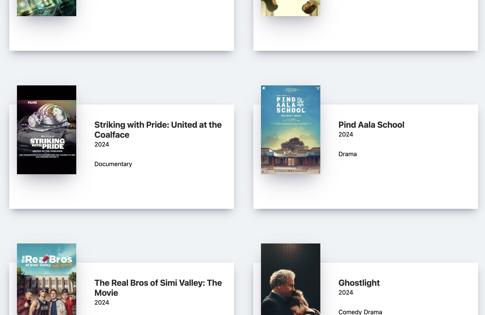

# Movie-App Clone
Study Basic ReactJS

## 🔗 Demo
https://jonghwa3471.github.io/study-react-movie-app-clone/

## 🖥 Preview

## 🔥 Stack

### Front-end

### Deploy

## ✅ Packages

- [x] React
- [x] GitHub

## 📖 Theory

- [x] fetch
- [x] useState
- [x] useEffect
- [x] Link Tag
- [x] blabla.module.css

## 📱 View

- [x] Movie List
- [x] More Info
